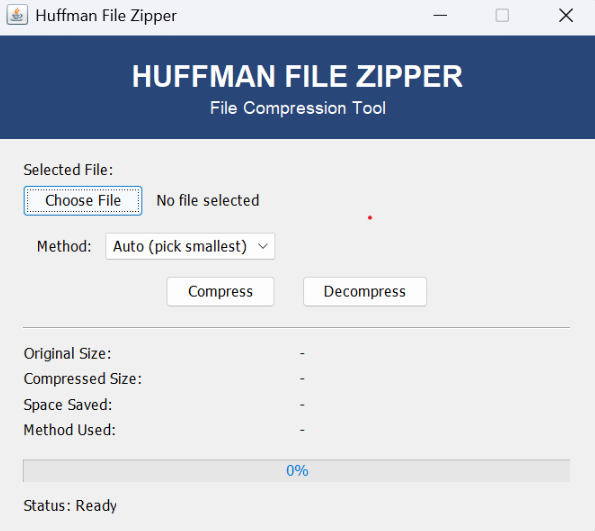
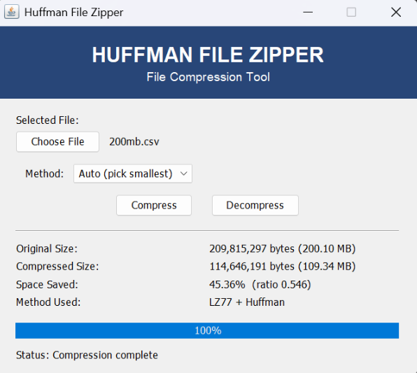

## 📸 Preview

### Application Interface



### Compression Completed



# Huffman File Zipper

A Java-based **lossless file compression and decompression tool** that uses **Huffman Coding** and **LZ77** algorithms. The project also provides a simple Java Swing GUI with multiple compression modes and automatic method selection.

---

## 🚀 Features

- Lossless file compression and decompression
- Huffman Coding
- LZ77 compression
- LZ77 + Huffman combined compression
- Automatic compression method selection
- Custom ".huf" compressed file format
- Binary/bit-level file processing
- Min Heap / Priority Queue based Huffman Tree construction
- Hash-based LZ77 pattern matching
- 64 KB LZ77 sliding window
- Compression statistics
- Space saved calculation
- Compression ratio calculation
- Real-time progress bar
- Background processing using `SwingWorker`
- Buffered file I/O for large files
- Supports arbitrary binary files
- Handles files that may not benefit from compression


---
 # 🛠️ Technologies Used

| Technology | Purpose |
|---|---|
| **Java** | Core programming language |
| **Java Swing** | Graphical User Interface |
| **Java I/O** | File reading and writing |
| **Java Collections** | Priority Queue and data structures |
| **Java NIO** | File and path handling |
| **Multithreading** | Background compression/decompression |
| **Binary/Bit Processing** | Huffman encoding and decoding |

---

# 🖥️ GUI

The application is built using **Java Swing**.

The GUI provides:

- File selection
- Compression method selection
- Compress button
- Decompress button
- Progress bar
- Status messages
- Original file size
- Compressed file size
- Compression ratio
- Space saved
- Method used

---

## 🖥️ Application

The application provides three compression methods:

- **Auto (pick smallest)**
- **Huffman only**
- **LZ77 + Huffman**

Example:

```text
Original Size:       200.10 MB
Compressed Size:     109.34 MB
Space Saved:         45.36%
Compression Ratio:   0.546
Method Used:         LZ77 + Huffman